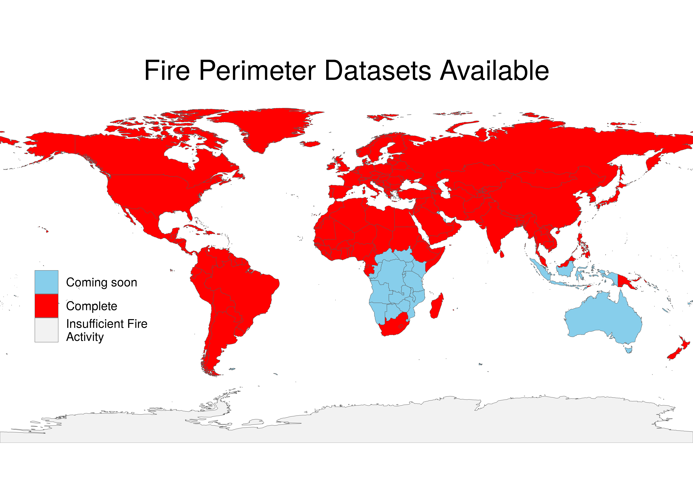

     

# FIREDpy - FIRe Event Delineation for python

A Python Command Line Interface for classifying fire events from the Collection 6 MODIS Burned Area Product.

This package uses a space-time window to classify individual burn detections from late 2001 to near-present into discrete events and return both a data table and shapefiles of these events. The user is able to specify the spatial and temporal parameters of the window, as well as the area of interest using either a shapefile or a list of MODIS Sinusoidal Projection tile IDs. Shapefiles include full- and daily-level event polygons, providing a representation of both final and expanding event perimeters. 

Any area from the world may be selected. However, in the current version, memory constraints may limit the extent available for a single model run. Equatorial regions have much more fire activity, and will require much more RAM to process at this point in time, than a normal laptop will have.

More methodological information is at:

Balch, J. K., St. Denis, L. A., Mahood, A. L., Mietkiewicz, N. P., Williams, T. P., McGlinchy J,
and Cook, M. C. 2020. FIRED (Fire Events Delineation): An open, flexible algorithm & database
of U.S. fire events derived from the MODIS burned area product (2001-19). Remote
Sensing, 12(21), 3498; https://doi.org/10.3390/rs12213498

## Have you used firedpy?

please take this [survey](https://docs.google.com/forms/d/e/1FAIpQLSe7ycmS0HGIze2T6TIUox8hsu8nlGsxiUMww8SCeWHDZPhB-Q/viewform?usp=sf_link) to help us improve firedpy.

## Current status of created products

Already-created products are housed in the CU Scholar data repository in the [Earth Lab Data collection](https://scholar.colorado.edu/collections/pz50gx05h), or [here](https://scholar.colorado.edu/catalog?f%5Bacademic_affiliation_sim%5D%5B%5D=Earth+Lab&locale=en). 

All of the created products have an event-level shapefile in .gpkg format. Many countries also have the daily-level shapefile, but these were not created for most countries in Africa and Asia due to computational restrictions. We are working to include each event-level product in ESRI shapefile format. This will happen by the end of 2021.

We currently have fire histories from November 2000 - May 2021 for:

### North America
 - [Coterminous USA + Alaska](https://scholar.colorado.edu/concern/datasets/d504rm74m)
 - [US plus Canada](https://scholar.colorado.edu/concern/datasets/8336h304x)
 - [Hawaii](https://scholar.colorado.edu/concern/datasets/7h149r06p)
 - [All the countries in the Carribean](https://scholar.colorado.edu/concern/datasets/x633f230f)
 - [Mexico and Central America](https://scholar.colorado.edu/concern/datasets/vd66w1102)

### South America
 - [Bolivia](https://scholar.colorado.edu/concern/datasets/b2773w83t)
 - [Argentina](https://scholar.colorado.edu/concern/datasets/5t34sk58k)
 - [Northern South America (Suriname, French Guiana, Guyana)](https://scholar.colorado.edu/concern/datasets/qv33rx839)
 - [Chile](https://scholar.colorado.edu/concern/datasets/qr46r2052)
 - [Uruguay](https://scholar.colorado.edu/concern/datasets/q524jq130)
 - [Brazil](https://scholar.colorado.edu/concern/datasets/05741s90q)
 - [Peru](https://scholar.colorado.edu/concern/datasets/x346d5616)
 - [Colombia](https://scholar.colorado.edu/concern/datasets/mp48sd91d)
 - [Ecuador](https://scholar.colorado.edu/concern/datasets/pc289k34n)
 - [Venezuela](https://scholar.colorado.edu/concern/datasets/7m01bm95m)
 - [Paraguay](https://scholar.colorado.edu/concern/datasets/rb68xd05p)
 
[Entire Western hemisphere from Jan 2017 to March 2020, intended for use in conjunction with GOES16 active fire detections.](https://scholar.colorado.edu/concern/datasets/d217qq78g)

### Europe (November 2000 to July 2021)
 - [Northern Europe (Iceland, Sweden, Norway, and Denmark)](https://scholar.colorado.edu/concern/datasets/sb397945f)
 - [Russia](https://scholar.colorado.edu/concern/datasets/q811kk87t)
 - [Italy](https://scholar.colorado.edu/concern/datasets/v979v416g)
 - [Spain & Portugal](https://scholar.colorado.edu/concern/datasets/gb19f7006)
 - [Western Europe (France, Germany, Poland, Switzerland, Belgium, Netherlands, Luxembourg and Austria)](https://scholar.colorado.edu/concern/datasets/v692t736f)
 - [Central to Southern Europe (Estonia, Latvia, Lithuania, Belarus, Ukraine, Czech Republic, Slovakia, Hungary, Romania, Bulgaria, Montenegro, Bosnia, Turkey, Republic Of Moldova, Serbia, Albania, Slovenia, and North Macedonia)](https://scholar.colorado.edu/concern/datasets/7h149r07z)
 - [Greece](https://scholar.colorado.edu/concern/datasets/bc386k355)
 - [UK and Ireland](https://scholar.colorado.edu/concern/datasets/pc289k33c)

### Africa
 - [Senegal](https://scholar.colorado.edu/concern/datasets/tt44pp176)
 - [The Gambia](https://scholar.colorado.edu/concern/datasets/pn89d7911)
 - [Morocco](https://scholar.colorado.edu/concern/datasets/td96k3751)
 - [Central North Africa (Libya, Algeria, Tunisia)](https://scholar.colorado.edu/concern/datasets/8910jv77j)
 - [Madagascar](https://scholar.colorado.edu/concern/datasets/fb494955x)
 - [Mali](https://scholar.colorado.edu/concern/datasets/pr76f4544)
 - [Mauritania](https://scholar.colorado.edu/concern/datasets/x059c864s)
 - [Guinea](https://scholar.colorado.edu/concern/datasets/05741s910)
 - [Guinea-Bissau](https://scholar.colorado.edu/concern/datasets/nc580n858)
 - [Sierra Leone](https://scholar.colorado.edu/concern/datasets/5712m779r)
 - [Eritrea](https://scholar.colorado.edu/concern/datasets/5m60qt182)
 - [Somalia](https://scholar.colorado.edu/concern/datasets/xd07gt798)
 - [Somaliland](https://scholar.colorado.edu/concern/datasets/8c97kr53f)
 - [Djibouti](https://scholar.colorado.edu/concern/datasets/1831cm01x)
 - [Ethiopia](https://scholar.colorado.edu/concern/datasets/z316q2977)
 - [Ivory Coast](https://scholar.colorado.edu/concern/datasets/vq27zp62f)
 - [Liberia](https://scholar.colorado.edu/concern/datasets/6h440t58k)
 - [Benin](https://scholar.colorado.edu/concern/datasets/z603qz58m)
 - [Togo](https://scholar.colorado.edu/concern/datasets/fj236325p)
 - [Burkina Faso](https://scholar.colorado.edu/concern/datasets/9g54xj875)
 - [Niger](https://scholar.colorado.edu/concern/datasets/m039k605q)
 - [Ghana](https://scholar.colorado.edu/concern/datasets/2r36tz735)
 - [Sudan](https://scholar.colorado.edu/concern/datasets/g158bj37v)
 - [Nigeria](https://scholar.colorado.edu/concern/datasets/cv43nx78p)
 - [Equatorial Guinea](https://scholar.colorado.edu/concern/datasets/vx021g32b)
 - [Cameroon](https://scholar.colorado.edu/concern/datasets/x920fz208)

### Asia
 - [China](https://scholar.colorado.edu/concern/datasets/qz20st810)
 - [India](https://scholar.colorado.edu/concern/datasets/ht24wk47t)
 - [Central Asia (Turkmenistan, Kazakhstan, Uzbekistan, Kyrgystan, Tajikistan, Afghanistan, and Pakistan)](https://scholar.colorado.edu/concern/datasets/47429b07v)
 - [Middle East (Saudi Arabia, Quatar, Oman, Yemen, United Arab Emirates, Iraq, Jordan, Syria, Israel, Palestine, Lebanon, Egypt)](https://scholar.colorado.edu/concern/datasets/5d86p139h)
 - [Mongolia](https://scholar.colorado.edu/concern/datasets/4x51hk21h)
 - [Caucasus (Armenia, Azerbaijan, Georgia)](https://scholar.colorado.edu/concern/datasets/gf06g385j)

### Australia (state by state)
 - [Tasmania](https://scholar.colorado.edu/concern/datasets/c534fq19w)
 - [Victoria](https://scholar.colorado.edu/concern/datasets/2r36tz74f)

## Installation

There are two ways to install firedpy. Method one is to run it out of a docker container, Method 2 is to install locally.

### Method 1. Run from a Docker Container:

#### 1.1 Get the docker container running:

  - `docker run -t -d earthlab/firedpy`
  - **NOTE** due to technical difficulties, use `docker run -t -d admahood/firedpy` for the time being.

  - Call `docker ps` to get the name of the docker container you just created.

  - Then get into the docker container by running docker exec:

    `docker exec -it <silly_name> /bin/bash`

  - Then you will be inside of the docker container in the firedpy directory. Now, enter:

    `conda activate firedpy`

    And the environment is ready to use.

#### 1.2 Copy firedpy outputs to your local machine

After creating a new fire product, it might be useful to get it out of the docker container in order to use it.

  - First, exit the docker container by typing

    `exit`

  - Second, copy the file out. Here we will use the example of a container with the name "unruffled_clarke". The `docker cp` command uses the syntax `docker cp <source> <destination>`. Files inside of a docker container will have a prefix of the docker container name (or container ID) followed by a colon, then with a normal path.

    Here is an example command using the container name:

    `docker cp unruffled_clarke:/home/firedpy/proj/outputs/shapefiles/fired_events_s5_t11_2020153.gpkg /home/Documents/fired_events_s5_t11_2020153.gpkg`

    Another example command using the container ID:

    `docker cp fa73c6d3e007:/home/firedpy/proj/outputs/shapefiles/fired_events_s5_t11_2020153.gpkg /home/Documents/fired_events_s5_t11_2020153.gpkg`

### Method 2. Local Installation Instructions:

  - Clone this repository to a local folder and change directories into it:

    `git clone https://github.com/earthlab/firedpy.git`

    `cd firedpy`

  - Create and activate a conda environment:

    `conda env create -f environment.yaml`

    `conda activate firedpy`  

  - Install locally:

    `python setup.py install`

## Use:
  - Run firedpy with no options to be prompted with input questions for each option/attribute
     
    `firedpy` 
    
  - Or use the following commands in your command line to specify the options/attributes you would like:   

  - In your terminal use this command to print out the available options and their descriptions:

    `firedpy --help`

  - Run firedpy with the default option to download required data and write a data table of classified fire events to a temporary directory. This uses CONUS as the default area of interest with a spatial parameter of 5 pixels (~2.3 km) and 11 days:

    `firedpy --default`

  - Change the spatial and temporal parameters of the model run:

    `firedpy -spatial 6 -temporal 10`

  - Specify specific tiles and a local project_directory for required data and model outputs:

    `firedpy -spatial 6 -temporal 10 -aoi h11v09 h12v09 -proj_dir /home/<user>/fired_project`

  - Write shapefiles as outputs in addition to the data table:

    `firedpy -spatial 6 -temporal 10 -aoi h11v09 h12v09 -proj_dir /home/<user>/fired_project --shapefile`

  - Add the most common level 3 Ecoregion as an attribute to each event:

    `firedpy -spatial 6 -temporal 10 -aoi h11v09 h12v09 -proj_dir /home/<user>/fired_project --shapefile -ecoregion_level 3`

  - Add landcover information and produce the daily burn file

    `firedpy -spatial 6 -temporal 10 -aoi h11v09 h12v09 -proj_dir /home/<user>/fired_project --shapefile -ecoregion_level 3 -landcover_type 1 -daily yes`

  For more information about each parameter, use:

    'firedpy --help'
    
    
### Parameter table (under construction)
  
| parameter | value(s)| example | description|
|:--------------|:----------|:-----|:---------|
| -spatial | integer | -spatial 5 | pixel radius for moving window, defaults to 5|
| -temporal | integer | -temporal 11 | day radius for moving window, defaults to 11|
| -aoi | character (MODIS tile) | -aoi h11v09 | which modis tiles should be used |
| -aoi | character (shapefile) | -aoi /home/firedpy/individual_countries/canada.gpkg | figures out which modis tiles to download based on the polygon -- **polygon must be in the same projection as MODIS MCD64** -- all the polygons in the *ref* folder are correctly projected and can be used as crs templates to prepare other polygons. |
| -proj_dir| character| -proj_dir /home/firedpy/proj | which directory should firedpy operate within? Defaults to a folder called "proj" within the current working directory.|
| -ecoregion_type | character | -ecoregion_type na | type of ecoregion, either world or na|
 | -ecoregion_level | integer | -ecoregion_level 3 | if ecoregion type = na, the level (1-3) of North American ecoregions |
 | -landcover_type | integer and character | -landcover_type 2:username:password | number (1-3) corresponding with a MODIS/Terra+Aqua Land Cover (MCD12Q1) category. You will need to also make an account at https://urs.earthdata.nasa.gov/home and include your login information within the argument. |
 | -shp_type | character | -shp_type gpkg | option to build a shapefile for the fired event in gpkg, ESRI shapefile (shp), both, or none  |
 | -file | character | -file fired_colorado | specifies the base of the file name for the tables and shapefile outputs, defaults to "fired", in the format: "(-file aruguement)_toYYYYDDD_(either events or daily).gpkg", with YYYY being the year, and DDD being the julian day of the last month in the time series. The example would output fired_colorado_to2021031_events.gpkg.|
 | -daily | character (yes or no) | -daily yes | creates daily polygons, if no just the event-level perimeters will be created. Defaults to no. |
 | -start_yr |integer | -start_yr 2001 | gets the hdf files from the MODIS tiles starting in this year. The first year avalible is 2001 |
 | -end_yr |integer | -end_yr 2021 | gets the hdf files from the MODIS tiles ending in this year. The last year avalible is 2021 |
 
 
 
### Boundary files are available for use as areas of interest
 
 - Country boundaries are in **ref/individual_countries**
 - Continent boundaries are in **ref/continents**
 - United States state boundaries for the United States of America are in **ref/us_states**
 - Australian state boundaries are in **ref/australian_states**
 - For example `firedpy -tiles ref/us_states/colorado.gpkg`, and so on. Every space is a '_'. 
 - If using the user input option, when prompted for the name of the continent, country, or state use "_" for spaces. 
 - **Ensure that the input shapefiles are in the modis sinusiodal projection**
