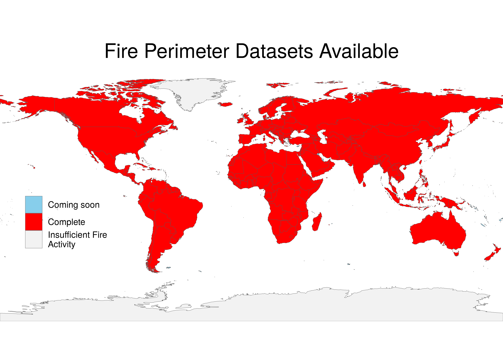

     

# FIREDpy - FIRe Event Delineation for python

A Python Command Line Interface for classifying fire events from the Collection 6 MODIS Burned Area Product.

This package uses a space-time window to classify individual burn detections from late 2001 to near-present into discrete events and return both a data table and shapefiles of these events. The user is able to specify the spatial and temporal parameters of the window, as well as the spatial and temporal extent, using either a shapefile or a list of MODIS Sinusoidal Projection tile IDs. Shapefiles include full event polygons by default, and the user has the option of having firedpy produce daily-level perimeters, providing a representation of both final and expanding event perimeters. 

Any area from the world may be selected. However, in the current version, memory constraints may limit the extent available for a single model run. Equatorial regions have much more fire activity, and may require much more RAM to process than a normal laptop will have.

More methodological information is at:

Balch, J. K., St. Denis, L. A., Mahood, A. L., Mietkiewicz, N. P., Williams, T. P., McGlinchy J,
and Cook, M. C. 2020. FIRED (Fire Events Delineation): An open, flexible algorithm & database
of U.S. fire events derived from the MODIS burned area product (2001-19). Remote
Sensing, 12(21), 3498; https://doi.org/10.3390/rs12213498

Description of the country-level data sets is at: 

Mahood, A.L. Lindrooth, E.J., Cook, M.C. and Balch, J.K. Country-level fire perimeter datasets (2001-2021). 2022. Nature Scientific Data, 9(458). https://doi.org/10.1038/s41597-022-01572-3

### BUG ALERT: 

Many of the data products created in Fall 2021 may be shifted by a half pixel, and may lack a coordinate reference system. 

The problem is now fixed, so this will not affect new iterations of firedpy. We created a script, R/posthoc_fixes.R that contains a function to fix either or both of these problems.

Sometimes the server (fuoco.geog.umd.edu) that houses the MCD64A1 product used by firedpy is down. If this happens, you just need to wait until it comes back up.

See the issues tab for more bugs, or to report a new bug!

## Have you used firedpy?

The algorithm and derived data products are under active development. Please take this [survey](https://docs.google.com/forms/d/e/1FAIpQLSe7ycmS0HGIze2T6TIUox8hsu8nlGsxiUMww8SCeWHDZPhB-Q/viewform?usp=sf_link) to help us improve firedpy.

## Current status of created products

Already-created products are linked below. They are housed in the CU Scholar data repository in the [Earth Lab Data collection](https://scholar.colorado.edu/collections/pz50gx05h), or [here](https://scholar.colorado.edu/catalog?f%5Bacademic_affiliation_sim%5D%5B%5D=Earth+Lab&locale=en). 

All of the created products have an event-level shapefile in .gpkg and .shp formats. Many countries also have the daily-level shapefile, but these were not created for most countries in Africa and Asia due to computational restrictions. 

## Click on a link below to download a fire perimeter dataset for your favorite country

### North America
 - [Coterminous USA + Alaska](https://scholar.colorado.edu/concern/datasets/d504rm74m)
 - [US plus Canada](https://scholar.colorado.edu/concern/datasets/8336h304x)
 - [Canada](https://scholar.colorado.edu/concern/datasets/gf06g388c)
 - [Hawaii](https://scholar.colorado.edu/concern/datasets/7h149r06p)
 - [Carribean (Barbados, Bahamas, Cayman Islands, Cuba, Dominican Republic, Haiti, Jamaica, Montserrat, Puerto Rico, Saint Kitts And Nevis, Trinidad And Tobago, British Virgin Islands, Guadeloupe, Saint Barthelemy)](https://scholar.colorado.edu/concern/datasets/x633f230f)
 - [Mexico and Central America (Belize, Guatemala, Honduras, El Salvador, Nicaragua, Costa Rica, Panama)](https://scholar.colorado.edu/concern/datasets/vd66w1102)

### South America
 - [Bolivia](https://scholar.colorado.edu/concern/datasets/b2773w83t)
 - [Argentina](https://scholar.colorado.edu/concern/datasets/5t34sk58k)
 - [Northern South America (Suriname, French Guiana, Guyana)](https://scholar.colorado.edu/concern/datasets/qv33rx839)
 - [Chile](https://scholar.colorado.edu/concern/datasets/qr46r2052)
 - [Uruguay](https://scholar.colorado.edu/concern/datasets/q524jq130)
 - [Brazil](https://scholar.colorado.edu/concern/datasets/05741s90q)
 - [Peru](https://scholar.colorado.edu/concern/datasets/x346d5616)
 - [Colombia](https://scholar.colorado.edu/concern/datasets/mp48sd91d)
 - [Ecuador](https://scholar.colorado.edu/concern/datasets/pc289k34n)
 - [Venezuela](https://scholar.colorado.edu/concern/datasets/7m01bm95m)
 - [Paraguay](https://scholar.colorado.edu/concern/datasets/rb68xd05p)
 
[Entire Western hemisphere from Jan 2017 to March 2020, intended for use in conjunction with GOES16 active fire detections.](https://scholar.colorado.edu/concern/datasets/d217qq78g)

### Europe
 - [Northern Europe (Iceland, Sweden, Norway, and Denmark)](https://scholar.colorado.edu/concern/datasets/sb397945f)
 - [Finland](https://scholar.colorado.edu/concern/datasets/6395w836j)
 - [Russia](https://scholar.colorado.edu/concern/datasets/q811kk87t)
 - [Italy](https://scholar.colorado.edu/concern/datasets/v979v416g)
 - [Spain & Portugal](https://scholar.colorado.edu/concern/datasets/gb19f7006)
 - [Western Europe (France, Germany, Poland, Switzerland, Belgium, Netherlands, Luxembourg and Austria)](https://scholar.colorado.edu/concern/datasets/v692t736f)
 - [Central to Southern Europe (Estonia, Latvia, Lithuania, Belarus, Ukraine, Czech Republic, Slovakia, Hungary, Romania, Bulgaria, Montenegro, Bosnia, Turkey, Republic Of Moldova, Serbia, Albania, Slovenia, and North Macedonia)](https://scholar.colorado.edu/concern/datasets/7h149r07z)
 - [Greece](https://scholar.colorado.edu/concern/datasets/bc386k355)
 - [UK and Ireland](https://scholar.colorado.edu/concern/datasets/pc289k33c)

### Africa

 - [Angola](https://scholar.colorado.edu/concern/datasets/t435gf21z)
 - [Benin](https://scholar.colorado.edu/concern/datasets/z603qz58m)
 - [Botswana](https://scholar.colorado.edu/concern/datasets/b8515p69g)
 - [Burundi](https://scholar.colorado.edu/concern/datasets/3f462659h)
 - [Burkina Faso](https://scholar.colorado.edu/concern/datasets/9g54xj875)
 - [Cameroon](https://scholar.colorado.edu/concern/datasets/x920fz208)
 - [Central North Africa (Libya, Algeria, Tunisia)](https://scholar.colorado.edu/concern/datasets/8910jv77j)
 - [Chad](https://scholar.colorado.edu/concern/datasets/707958762)
 - [Central African Republic](https://scholar.colorado.edu/concern/datasets/pv63g1576)
 - [Democratic Republic of the Congo](https://scholar.colorado.edu/concern/datasets/5425kb88g)
 - [Djibouti](https://scholar.colorado.edu/concern/datasets/1831cm01x)
 - [Equatorial Guinea](https://scholar.colorado.edu/concern/datasets/vx021g32b)
 - [Eritrea](https://scholar.colorado.edu/concern/datasets/5m60qt182)
 - [eSwatini](https://scholar.colorado.edu/concern/datasets/9w0324116)
 - [Ethiopia](https://scholar.colorado.edu/concern/datasets/z316q2977)
 - [Gabon](https://scholar.colorado.edu/concern/datasets/2z10wr67h)
 - [The Gambia](https://scholar.colorado.edu/concern/datasets/pn89d7911)
 - [Ghana](https://scholar.colorado.edu/concern/datasets/2r36tz735)
 - [Guinea](https://scholar.colorado.edu/concern/datasets/05741s910)
 - [Guinea-Bissau](https://scholar.colorado.edu/concern/datasets/nc580n858)
 - [Ivory Coast](https://scholar.colorado.edu/concern/datasets/vq27zp62f)
 - [Kenya](https://scholar.colorado.edu/concern/datasets/1j92g871c)
 - [Lesotho](https://scholar.colorado.edu/concern/datasets/cr56n229w)
 - [Liberia](https://scholar.colorado.edu/concern/datasets/6h440t58k)
 - [Madagascar](https://scholar.colorado.edu/concern/datasets/fb494955x)
 - [Malawi](https://scholar.colorado.edu/concern/datasets/5999n464m)
 - [Mali](https://scholar.colorado.edu/concern/datasets/pr76f4544)
 - [Mauritania](https://scholar.colorado.edu/concern/datasets/x059c864s)
 - [Morocco](https://scholar.colorado.edu/concern/datasets/td96k3751)
 - [Mozambique](https://scholar.colorado.edu/concern/datasets/1n79h5504)
 - [Namibia](https://scholar.colorado.edu/concern/datasets/db78td244)
 - [Niger](https://scholar.colorado.edu/concern/datasets/m039k605q)
 - [Nigeria](https://scholar.colorado.edu/concern/datasets/cv43nx78p)
 - [Republic of the Congo](https://scholar.colorado.edu/concern/datasets/nk322f305)
 - [Rwanda](https://scholar.colorado.edu/concern/datasets/st74cr782)
 - [Senegal](https://scholar.colorado.edu/concern/datasets/tt44pp176)
 - [Sierra Leone](https://scholar.colorado.edu/concern/datasets/5712m779r)
 - [Somalia](https://scholar.colorado.edu/concern/datasets/xd07gt798)
 - [Somaliland](https://scholar.colorado.edu/concern/datasets/8c97kr53f)
 - [South Africa](https://scholar.colorado.edu/concern/datasets/rf55z8833)
 - [South Sudan](https://scholar.colorado.edu/concern/datasets/b2773w89g)
 - [Sudan](https://scholar.colorado.edu/concern/datasets/g158bj37v)
 - [Tanzania](https://scholar.colorado.edu/concern/datasets/7w62f947x)
 - [Togo](https://scholar.colorado.edu/concern/datasets/fj236325p)
 - [Uganda](https://scholar.colorado.edu/concern/datasets/hh63sx004)
 - [Zambia](https://scholar.colorado.edu/concern/datasets/6108vc441)
 - [Zimbabwe](https://scholar.colorado.edu/concern/datasets/f7623d95c)

### Asia

 - [China](https://scholar.colorado.edu/concern/datasets/qz20st810)
 - [India](https://scholar.colorado.edu/concern/datasets/ht24wk47t)
 - [Central Asia (Turkmenistan, Kazakhstan, Uzbekistan, Kyrgystan, Tajikistan, Afghanistan, and Pakistan)](https://scholar.colorado.edu/concern/datasets/47429b07v)
 - [Middle East (Saudi Arabia, Qatar, Oman, Yemen, United Arab Emirates, Iraq, Jordan, Syria, Israel, Palestine, Lebanon, Egypt)](https://scholar.colorado.edu/concern/datasets/5d86p139h)
 - [Mongolia](https://scholar.colorado.edu/concern/datasets/4x51hk21h)
 - [Caucasus (Armenia, Azerbaijan, Georgia)](https://scholar.colorado.edu/concern/datasets/gf06g385j)
 - [Japan](https://scholar.colorado.edu/concern/datasets/dz010r34v)
 - [South Korea](https://scholar.colorado.edu/concern/datasets/pg15bg177)
 - [North Korea](https://scholar.colorado.edu/concern/datasets/3j333327g)
 - [Taiwan](https://scholar.colorado.edu/concern/datasets/df65v9276)
 - [Sri Lanka](https://scholar.colorado.edu/concern/datasets/9z9030982)
 - [Nepal](https://scholar.colorado.edu/concern/datasets/mk61rj10w)
 - [Bhutan](https://scholar.colorado.edu/concern/datasets/n009w342h)
 - [Bangladesh](https://scholar.colorado.edu/concern/datasets/d791sh33k)
 - [Vietnam](https://scholar.colorado.edu/concern/datasets/h702q7566)
 - [Thailand](https://scholar.colorado.edu/concern/datasets/xs55md39h)
 - [Laos](https://scholar.colorado.edu/concern/datasets/bz60cx389)
 - [Myanmar](https://scholar.colorado.edu/concern/datasets/pk02cb86p)

### Australia (state by state)

 - [Tasmania](https://scholar.colorado.edu/concern/datasets/c534fq19w)
 - [Victoria](https://scholar.colorado.edu/concern/datasets/2r36tz74f)
 - [New South Wales + Capital Territory](https://scholar.colorado.edu/concern/datasets/37720d85c)
 - [Queensland](https://scholar.colorado.edu/concern/datasets/cr56n230n)
 - [South Australia](https://scholar.colorado.edu/concern/datasets/fn107015p)
 - [Western Australia](https://scholar.colorado.edu/concern/datasets/k35695559)
 - [Northern Territory](https://scholar.colorado.edu/concern/datasets/bn9997900)

### Oceania

 - [Philippines](https://scholar.colorado.edu/concern/datasets/7d278v06f)
 - [Papua New Guinea](https://scholar.colorado.edu/concern/datasets/3r074w183)
 - [East Timor](https://scholar.colorado.edu/concern/datasets/j098zc184)
 - [New Zealand](https://scholar.colorado.edu/concern/datasets/9g54xj88f)
 - [Malaysia](https://scholar.colorado.edu/concern/datasets/fq977w13f)
 - [Brunei](https://scholar.colorado.edu/concern/datasets/mp48sd92p)
 - [Indonesia](https://scholar.colorado.edu/concern/datasets/p2676w918)

## Installation

There are two ways to install firedpy. Method one is to run it out of a docker container, Method 2 is to install locally.

### Method 1. Run from a Docker Container:

#### 1.1 Get the docker container running:

  - `docker run -t -d earthlab/firedpy`
 
  - Call `docker ps` to get the name of the docker container you just created.

  - Then get into the docker container by running docker exec:

    `docker exec -it <silly_name> /bin/bash`

  - Then you will be inside of the docker container in the firedpy directory. Now, enter:

    `conda activate firedpy`

    And the environment is ready to use.

#### 1.2 Copy firedpy outputs to your local machine

After creating a new fire product, it might be useful to get it out of the docker container in order to use it.

  - First, exit the docker container by typing

    `exit`

  - Second, copy the file out. Here we will use the example of a container with the name "unruffled_clarke". The `docker cp` command uses the syntax `docker cp <source> <destination>`. Files inside of a docker container will have a prefix of the docker container name (or container ID) followed by a colon, then with a normal path.

    Here is an example command using the container name:

    `docker cp unruffled_clarke:/home/firedpy/proj/outputs/shapefiles/fired_events_s5_t11_2020153.gpkg /home/Documents/fired_events_s5_t11_2020153.gpkg`

    Another example command using the container ID:

    `docker cp fa73c6d3e007:/home/firedpy/proj/outputs/shapefiles/fired_events_s5_t11_2020153.gpkg /home/Documents/fired_events_s5_t11_2020153.gpkg`

### Method 2. Local Installation Instructions:

  - Clone this repository to a local folder and change directories into it:

    `git clone https://github.com/earthlab/firedpy.git`

    `cd firedpy`
    
  - Ensure your anaconda setup has **conda-forge**, **channel_priority** set to **strict**, and **update your conda**.

    `conda update conda --yes`
    `conda config --add channels conda-forge`
    `conda config --set channel_priority strict`
    
  - You must have all packages listed in the environment.yaml installed using 'conda install -c conda-forge <package_name>'

  - Create and activate a conda environment:

    `conda env create -f environment.yaml`

    `conda activate firedpy`  

  - Install locally:

    `python setup.py install`

## Use:
  - Run firedpy with no options to be prompted with input questions for each option/attribute
     
    `firedpy` 
    
  - Or use the following commands in your command line to specify the options/attributes you would like:   

  - In your terminal use this command to print out the available options and their descriptions:

    `firedpy --help`

  - Run firedpy with the default option to download required data and write a data table of classified fire events to a temporary directory. This uses CONUS as the default area of interest with a spatial parameter of 5 pixels (~2.3 km) and 11 days:

    `firedpy --default`

  - Change the spatial and temporal parameters of the model run:

    `firedpy -spatial 6 -temporal 10`

  - Specify specific tiles and a local project_directory for required data and model outputs:

    `firedpy -spatial 6 -temporal 10 -aoi h11v09 h12v09 -proj_dir /home/<user>/fired_project`

  - Write shapefiles as outputs in addition to the data table:

    `firedpy -spatial 6 -temporal 10 -aoi h11v09 h12v09 -proj_dir /home/<user>/fired_project --shapefile`

  - Add the most common level 3 Ecoregion as an attribute to each event:

    `firedpy -spatial 6 -temporal 10 -aoi h11v09 h12v09 -proj_dir /home/<user>/fired_project --shapefile -ecoregion_level 3`

  - Add landcover information and produce the daily burn file

    `firedpy -spatial 6 -temporal 10 -aoi h11v09 h12v09 -proj_dir /home/<user>/fired_project --shapefile -ecoregion_level 3 -landcover_type 1 -daily yes`

  For more information about each parameter, use:

    'firedpy --help'
    
    
### Parameter table (under construction)
  
| parameter | value(s)| example | description|
|:--------------|:----------|:-----|:---------|
| -spatial | integer | -spatial 5 | pixel radius for moving window, defaults to 5|
| -temporal | integer | -temporal 11 | day radius for moving window, defaults to 11|
| -aoi | character (MODIS tile) | -aoi h11v09 | which modis tiles should be used |
| -aoi | character (shapefile) | -aoi /home/firedpy/individual_countries/canada.gpkg | figures out which modis tiles to download based on the polygon -- **polygon must be in the same projection as MODIS MCD64** -- all the polygons in the *ref* folder are correctly projected and can be used as crs templates to prepare other polygons. |
| -proj_dir| character| -proj_dir /home/firedpy/proj | which directory should firedpy operate within? Defaults to a folder called "proj" within the current working directory.|
| -ecoregion_type | character | -ecoregion_type na | type of ecoregion, either world or na|
 | -ecoregion_level | integer | -ecoregion_level 3 | if ecoregion type = na, the level (1-3) of North American ecoregions |
 | -landcover_type | integer and character | -landcover_type 2:username:password | number (1-3) corresponding with a MODIS/Terra+Aqua Land Cover (MCD12Q1) category. You will need to also make an account at https://urs.earthdata.nasa.gov/home and include your login information within the argument. |
 | -shp_type | character | -shp_type gpkg | option to build a shapefile for the fired event in gpkg, ESRI shapefile (shp), both, or none  |
 | -file | character | -file fired_colorado | specifies the base of the file name for the tables and shapefile outputs, defaults to "fired", in the format: "(-file aruguement)_toYYYYDDD_(either events or daily).gpkg", with YYYY being the year, and DDD being the julian day of the last month in the time series. The example would output fired_colorado_to2021031_events.gpkg.|
 | -daily | character (yes or no) | -daily yes | creates daily polygons, if no just the event-level perimeters will be created. Defaults to no. |
 | -start_yr |integer | -start_yr 2001 | gets the hdf files from the MODIS tiles starting in this year. The first year avalible is 2001 |
 | -end_yr |integer | -end_yr 2021 | gets the hdf files from the MODIS tiles ending in this year. The last year avalible is 2021 |
 
 
 
### Boundary files are available for use as areas of interest
 
 - Country boundaries are in **ref/individual_countries**
 - Continent boundaries are in **ref/continents**
 - United States state boundaries for the United States of America are in **ref/us_states**
 - Australian state boundaries are in **ref/australian_states**
 - For example `firedpy -aoi /home/firedpy/ref/us_states/colorado.gpkg`, and so on. Every space is a '_'. 
 - If using the user input option, when prompted for the name of the continent, country, or state use "_" for spaces. 
 - **Ensure that the input shapefiles are in the modis sinusiodal projection**

## How to update the docker container

- step 0.1. install docker (go to the docker website for OS-specific instructions.)
- step 0.2. get a dockerhub account
- step 1. login to docker hub via the command line
   - `docker login` or `sudo docker login`
- step 2. get the existing docker image set up
   - docker run -t -d earthlab/firedpy
- step 3. update from github
   - git pull 
- step 4. build the docker container
   - `docker build -t earthlab/firedpy:latest .`
- step 5. **ENSURE THE SOFTWARE STILL WORKS BEFORE PUSHING**
   - `firedpy -aoi /home/firedpy/ref/individual_countries/samoa.gpkg`
- step 6. push it up to dockerhub
   - `docker push earthlab/firedpy:latest`
